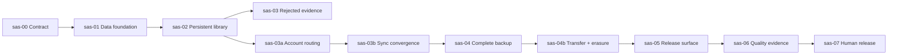

# FlashApp App Store 1.0 — batch graph

Status: active — sas-03a ready
Date: 2026-08-20
Decisions: `docs/decisions/ADR-006-app-store-v1-contract.md`,
`docs/decisions/ADR-007-account-scoped-stores.md`

## Graph

## Dispatch policy

- One owner at a time for `FlashUpData`, the Core Data model and `AppEnvironment`.
- Slices 03a, 03b, 04 and 04b are serialized under the same Data/AppEnvironment owner.
- The UI batch starts only after sync and backup contracts are stable.
- Release audit never runs in parallel with feature work.
- Every worker uses a scoped branch/worktree, reports completion, receives semantic review,
  and appends one worklog entry only when its acceptance criteria are honestly met.
- No task may touch `assets/emma-avatar/`.

## Human gate policy

`sas-07-human-release` is intentionally not ready for completion. Team/App ID/bundle/
container/schema/legal URLs/signing/archive/TestFlight/price/submission stay
`HUMAN_REQUIRED` until primary evidence is recorded. CloudKit E2E remains a submission
blocker even if every repository-only test passes.

## State

| Batch | State | Evidence |
| --- | --- | --- |
| sas-00-contract | Done | worker report + approved semantic review + validation |
| sas-01-data-foundation | Done | worker report + correctness/security approvals + tests |
| sas-02-persistent-library | Done | worker report + correctness/security approvals + tests |
| sas-03-private-sync | Superseded | rejected implementation retained as review evidence only |
| sas-03a-account-routing | Ready | owner resolved account boundary; ADR-007 accepted |
| sas-03b-sync-convergence | Pending | waits for accepted sas-03a |
| sas-04-complete-backup | Pending | waits for accepted sas-03b |
| sas-04b-scoped-transfer-erasure | Pending | waits for accepted sas-04 |
| sas-05-release-surface | Pending | waits for accepted sas-04b |
| sas-06-quality-evidence | Pending | waits for sas-05 |
| sas-07-human-release | HUMAN_REQUIRED | waits for sas-06 and Apple account evidence |
