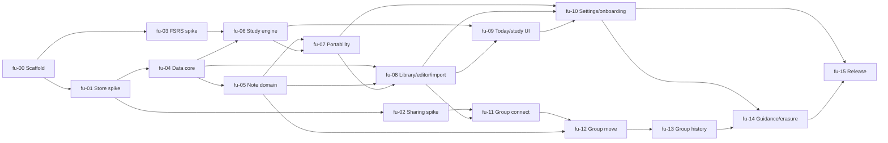

# FlashApp v1 — Token-efficient batch graph

Status: approved engineering specification converted into implementation batches on 2026-07-28.

> **Superseded for App Store version 1.0 on 2026-08-19.** ADR-006 removes Groups and the
> shared store from 1.0 and changes persistence, onboarding, backup, price and release
> gates. This graph remains historical evidence. New work is dispatched only from
> `docs/flywheel-runs/flash-app-store-v1/batch-plan.md`; open group/sharing batches here are
> deferred, not completed.

## Decision

The source plan's 48 B-prefixed beads are intentionally fine-grained. For implementation, that granularity would repeatedly reload the same Core Data model, FSRS contracts, and SwiftUI navigation surfaces. We retain the source IDs as acceptance coverage but dispatch 16 **batch beads**.

The compression rule is strict: combine work only when it shares an owner, code surface, fixtures, and a single integration verdict. Keep a bead separate when it proves an external behavior, protects private user data, or requires a multi-account/manual check.

| Batch | Source beads | Complexity | Why this is one batch | Must remain a gate |
| --- | --- | --- | --- | --- |
| `fu-00-scaffold` | B0.1 | M | One project/CI ownership boundary. | First compiling shell. |
| `fu-01-store-spike` | B0.2 | H | CloudKit topology has one external verdict and ADR. | Two-store/local-mode proof. |
| `fu-02-sharing-spike` | B0.3 | Critical | Sharing and graph movement are architecture-killing unknowns. | Two-account proof and ADR. |
| `fu-03-fsrs-spike` | B0.4 | H | Library API/mapping must be pinned before storage is written. | Deterministic replay proof. |
| `fu-04-data-core` | B1.1–B1.4 | Critical | Model, repositories, affinity, trash and sync hooks share the same Core Data seams and fixture set. | Model lint plus private-store affinity. |
| `fu-05-note-domain` | B2.1–B2.5 | H | Cloze, fingerprints, tags, generated cards, and conversion form one note-lifecycle contract. | Stable card identity across edits. |
| `fu-06-study-engine` | B3.1–B3.5 | Critical | Schedule, replay, queue, session, and metrics are one deterministic event-sourcing chain. | Permutation replay and undo. |
| `fu-07-portability` | B4.1, B4.2, B4.4, B4.5 | H | CSV parsing, import, export, and backup reuse data codecs and transactional fixtures. | Import atomicity and backup round trip. |
| `fu-08-library-edit-import` | B4.3, B5.1, B5.3–B5.6 | H | Shell, Library, editor, search, trash, and import flow need the same navigation and content view models. | Create/edit/import/trash vertical UI flow. |
| `fu-09-today-study-ui` | B5.2, B5.7, B6.1–B6.2 | H | Today, charts, session, and completion share metrics/session state and accessibility surfaces. | Resume/undo complete session UI test. |
| `fu-10-settings-onboarding` | B8.1, B8.2, B8.4, B8.6 | H | Settings is the host for backup, preferences, reminders, support, and onboarding triggers. | Backup UI round trip and reminder state machine. |
| `fu-11-group-connect` | B7.1–B7.2 | H | Creating and accepting a share are a single owner/member connection loop. | Two-account invitation acceptance. |
| `fu-12-group-move` | B7.3–B7.4 | Critical | Leave/remove and deck move both exercise the shared-zone graph and private-progress invariant. | Move checklist and schedule continuity. |
| `fu-13-group-history` | B7.5–B7.6 | H | Revision history and owner deletion share group ownership and participant failure UX. | Owner/member deletion checklist. |
| `fu-14-guidance-and-erasure` | B8.3, B8.5 | H | Contextual help and irreversible deletion belong in the final trust-and-guidance pass. | Two-account erase isolation. |
| `fu-15-release` | B0.5, B9.1–B9.3 | Critical/manual | Store configuration, audit, TestFlight, and App Store evidence are release operations, not implementation. | All release-matrix cells pass. |

## Dependency graph

## Fast execution policy

Use at most two implementation lanes until the data core is proven:

1. **Architecture lane:** `fu-00` -> `fu-01` -> `fu-02`, then `fu-11` -> `fu-12` -> `fu-13`.
2. **Product lane:** `fu-03`, then `fu-04` -> `fu-05` / `fu-06` -> `fu-07` -> `fu-08` -> `fu-09` -> `fu-10` -> `fu-14`.

`fu-05` and `fu-06` may run concurrently after `fu-04`; use one owner sequentially if preserving context is more valuable than calendar time. Do not parallelize `fu-12` with other writers to `FlashUpData` or the Core Data model. `fu-15` is never parallelized with feature work.

## Boundaries deliberately not compressed

- B0.2, B0.3, and B0.4 stay independent because each retires a different architecture risk.
- Sharing remains three batches because invitation handling, zone migration, and owner-history semantics require different manual evidence and have distinct rollback paths.
- Release is its own manual batch; passing unit tests is not App Store readiness.

## Delivery state

| Batch | Status | Evidence |
| --- | --- | --- |
| `fu-00-scaffold` | Done 2026-07-28 | `docs/worker-reports/flash-up-v1/fu-00-scaffold.md`, `docs/decisions/worklog.md` |
| `fu-03-fsrs-spike` | Done 2026-07-28 | `docs/worker-reports/flash-up-v1/fu-03-fsrs-spike.md`, `docs/decisions/ADR-003-fsrs.md` |
| `fu-04a-pure-domain` | Done 2026-07-28 | `docs/worker-reports/flash-up-v1/fu-04a-pure-domain.md` |
| `fu-04b-ui-on-fakes` | Done 2026-07-28 | `docs/worker-reports/flash-up-v1/fu-04b-ui-on-fakes.md` |
| all others | Open | — |

`fu-04a-pure-domain` is a bead added on 2026-07-28. It carries B2.1 out of
`fu-05-note-domain` and B4.1 out of `fu-07-portability`; the source specification lists both
as depending on B0.1 alone, so the graph is unchanged and only the dispatch order moved.
Both parent batches keep all their other source-bead coverage.

`fu-04b-ui-on-fakes` (2026-07-28) introduces the `LibraryRepository` boundary and an
in-memory implementation, so interface batches can proceed against real behaviour while the
persistence lane waits. It is a preview stage: `fu-06`, `fu-08` and `fu-09` keep all their
source-bead coverage.

**Blocked, and this is now the critical path:** `fu-01-store-spike` needs a real iCloud
container and `fu-02-sharing-spike` needs two Apple accounts. The owner confirmed on
2026-07-28 that no paid Apple Developer account exists yet, so `fu-01`, `fu-02` and
everything downstream of them — including `fu-04-data-core` — cannot start. No further
persistence, sync, group or UI batch can be dispatched until that account exists.

Resolved 2026-07-28: the minimum deployment target stays iOS 17 and Liquid Glass is applied
progressively (`docs/decision-requests/flash-up-v1/liquid-glass-minimum-os.md`,
`docs/ux-principles.md`).

## Next agent prompt

Start with `docs/tasks/fu-00-scaffold.md`. Before dispatching any ready batch, validate that its original source-bead coverage is still correct and that any CloudKit or product decision is resolved. Update this plan and the Flywheel manifest before ending the pass.
